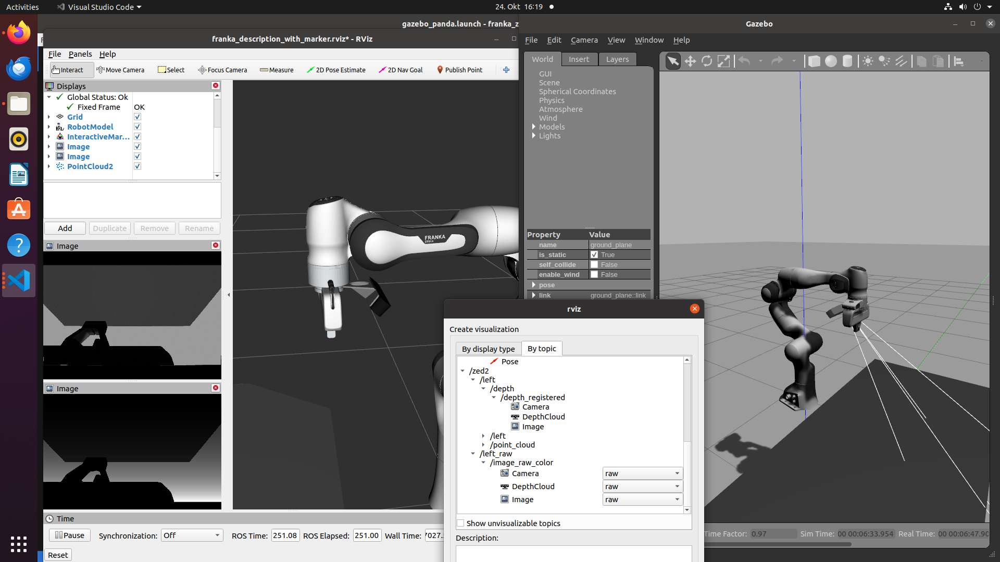

# franka_zed_gazebo



This repository contains the necessary files to launch a gazebo simulation of the Franka Panda set in the lab with the ZED2 camera attached to the end effector. It is importante to have the `franka_ros` in your ROS workspace. To launch the simulation run

```
roslaunch franka_zed_gazebo gazebo_panda.launch
```

The necessary data for the integration of the ZED2 camera in the Gazebo simulation was taken from the package created by [LeoRover for the European Rover Challenge ](https://github.com/LeoRover/leo_erc_common/blob/ec055bd2bb6cd69148a617dcf84b890470b27d0c/leo_erc_description/urdf/zed2.xacro)
