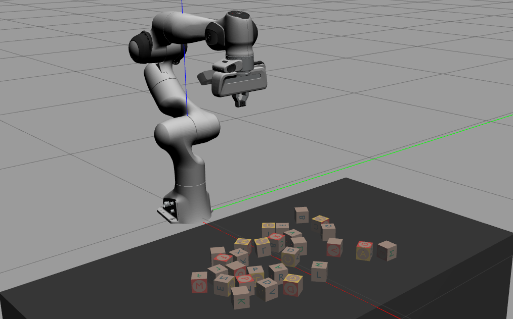
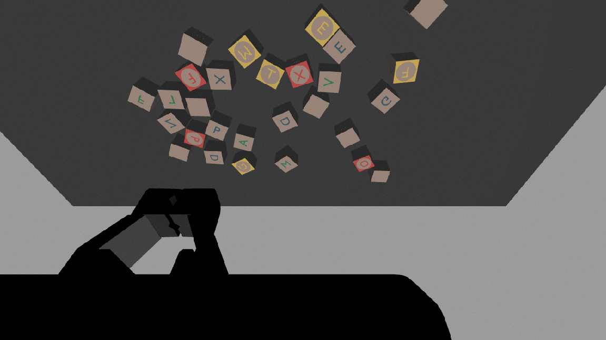
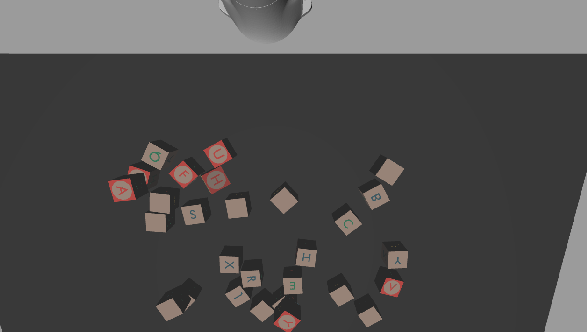

# Franka Zed Gazebo
### An educational simulation workspace for picking and placing with the Franka Emika Panda Robot

This repository contains the necessary files to launch a gazebo simulation of the Franka Panda set in the Pearl lab with the ZED2 camera attached to the end effector. 

<p align="center">
  
</p>

## Docker

To launch the simulation, you will need a few packages including `libfranka`, `franka_ros`, MoveIt! and `panda_moveit_config`. You can upull our Docker already set up with the necessary packages:

```
docker pull docker pull 3liyounes/pearl_robots:franka_wo_nvidia
```

If you will use the real ZED2 camera, you will need the Docker with cuda installation and the `zed_ros_wrapper` package:
```
docker pull docker pull 3liyounes/pearl_robots:franka
```

> [!NOTE]
> For installing docker, you can follow the [Pearl Lab instructions](https://github.com/iROSA-lab/Docker_env)

>[!TIP]
> Remember to allow any external programm X11 to access the GUI: 
> ```
> xhost +
> `

## Simulation

With all packages installed, you can launch the Gazebo simulator together with RviZ and the Motion Planning interface from MoveIt! and then spawn the cubes on the table. Manipulate the robot using the arrows and click on `Plan & Execute` to manually move the robot as you wish. You can add the image panels by clicking `Add`>`By topic` on the left panel and select the topic you want to visualize.

```
roslaunch franka_zed_gazebo moveit_gazebo_panda.launch
rosrun franka_zed_gazebo spawn_cubes.py
```

<p align="center">
  
</p>

> [!NOTE]
> You can control the number of cubes and how they are spawned by editing the end of the file `scripts/spawn_cubes.py`

> [!NOTE]
> There are two mount files possible for the ZED2 camera, including the gripper on the field view, on the left image below, and not including it, on the right image below. You can select the one you desire to work in simulation by editing the file `urdf/panda_camera.urdf.xacro`.
> 
> <p align="center">
>    
> </p>


## Real robot

If you want to use the real ZED2 camera on the real robot, make sure you have to have the right 3D printed mount file (with gripper on the field of view and without it), available inside the `3d_prints` folder. 

Turn on the robot (controller box under the table). Access the work desk by typing the ip addres of the robot in the browser. Unlock the robot before using. 

- If you are sending commands through ROS, activate the FCI and put in Execution mode.
- If you want to manually move the robot, activate Programming mode and, on the robot, press lightly at the same time the two buttons located on the left of the end-effector (check [manual](https://www.generationrobots.com/media/franka-emika-robot-handbook.pdf) for exact location)

If you are using the camera holder with the gripper in the field of view, edit the transformation in file `launch/real_robot_zed2.launch`. While in Execution mode, you can launch the camera together with the robot:

```
roslaunch franka_zed_gazebo real_robot_zed2.launch robot_ip:=192.168.1.35
```


>[!WARNING]
> Remember to keep the emergency button close at all times and push it immediately if it doesn't behave as expected or when there is a risk to damage the robot or anything/anyone around it. Unpush it and unlock it on the desk panel to continue working.

### Notes

The necessary data for the integration of the ZED2 camera in the Gazebo simulation was taken from the package created by [LeoRover for the European Rover Challenge ](https://github.com/LeoRover/leo_erc_common/blob/ec055bd2bb6cd69148a617dcf84b890470b27d0c/leo_erc_description/urdf/zed2.xacro)
